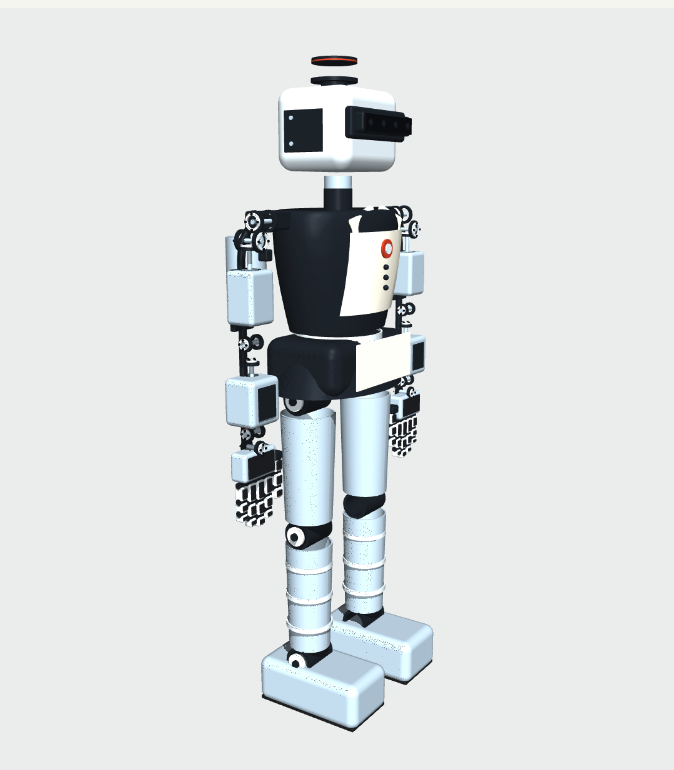

# Irona - The Flying Dexterous Humanoid



A **914.4 mm / 3-foot** Irona-inspired humanoid with native USD physics, two custom DYNAMIXEL-style seven-axis arms, two five-finger hands, an expressionless D455-style RGB-D sensor head, and a **360° × 30° 3D RTX lidar**. Includes CAD, printable exterior parts, ROS 2 launch files, RViz configuration, walking and simulated jet-flight controllers.

**Validation status:** native USD, CAD/STL and cross-format checks are included, and the revised dynamics have been exercised in MuJoCo. Isaac Sim 5.1 / PhysX, the ROS 2 bridge and RViz **have now been executed**: standing, 70 s of continuous walking, both sensors over ROS 2 and the camera-driven vase grasp all run, and `docs/ISAAC_RUN_NOTES.md` records what had to be fixed to get there, along with the limits found. Re-run the live acceptance test on your own workstation. The print kit is a full-size exterior/static display prototype, not a qualified powered robot or physical jet system.

## Launch everything, including RViz

Target: Linux with Isaac Sim **5.x**, an RTX-capable GPU, and ROS 2 Humble. The
demo below was run on Isaac Sim 5.1.0 with ROS 2 Humble. ROS 2 and Isaac Sim must
be installed separately; the archive does not contain those applications.

Build the ROS package once:

```bash
cd /absolute/path/to/irona_914/ros2
colcon build --symlink-install
```

Then use two terminals. **Terminal 1 — simulator** (no ROS environment sourced;
the script clears it deliberately, see *Environment notes*):

```bash
cd /absolute/path/to/irona_914
scripts/run_sim.sh --mode fetch --ros2          # walk, find the vase, grasp, lift
```

**Terminal 2 — viewer** (RViz and the TF tree, restartable on its own):

```bash
cd /absolute/path/to/irona_914
scripts/run_rviz.sh
```

RViz opens with the robot, the colour and depth image panels, cyan depth points,
height-coloured lidar points and an axis marker at `vase_estimate`, the pose the
head camera currently reports for the vase.

Other simulator modes:

```bash
scripts/run_sim.sh --mode walk --ros2               # walk continuously with both sensors
scripts/run_sim.sh --mode fetch --ros2 --carry      # resume walking after the lift
scripts/run_sim.sh --mode fetch --no-grasp-assist   # lift on finger friction alone
scripts/run_sim.sh --mode hands --seconds 16        # five-finger open/close demo
scripts/run_sim.sh --mode flight --seconds 16       # simulated vectored thrusters
scripts/run_sim.sh --mode walk --headless --ros2    # no simulator window; RTX sensors still render
```

Useful arguments: `--vase X Y` (vase position, default `1.0 -0.10`), `--pedestal H`,
`--no-vase`, `--grasp-side left|right`, `--seconds 0` for no time limit,
`--perception-log` to print every detection, `--usd-transforms` to mirror physics
into USD for tools that read the USD stage (about 5x slower).

`ros2 launch irona_sim rviz.launch.py` is the viewer launch file that `run_rviz.sh`
calls. The older all-in-one `irona_sim.launch.py` still exists, but starting Isaac
Sim from a ROS-sourced shell needs the environment handling described below, so
the two-terminal scripts are the supported path.

### Environment notes

Two environment details are not optional on this stack:

- **Isaac Sim must not inherit a sourced ROS 2 environment.** Isaac's Python is
  3.11, Humble's is 3.10, and the bridge ships its own Humble libraries. The
  simulator script clears `AMENT_PREFIX_PATH`, `ROS_DISTRO` and friends and points
  `LD_LIBRARY_PATH` at `isaacsim/exts/isaacsim.ros2.bridge/humble/lib`.
- **numpy 1.26 shim.** Isaac Sim 5.1.0-rc.19 ships numpy 2.2.6, but its
  `omni.graph` binding reads the numpy 1.x array descriptor layout, so every
  Python write to an OmniGraph array attribute fails with
  `Unable to write from unknown dtype, kind=..., size=0`. That breaks the ROS 2
  bridge graph setup and every replicator annotator, which means no camera, no
  lidar and no perception. `scripts/setup_isaac_numpy_shim.sh` installs numpy
  1.26.4 into `vendor/` and `run_sim.sh` puts it first on `PYTHONPATH`. Nothing in
  the Isaac Sim installation is modified.

## ROS interfaces

| Topic | Message / frame |
|---|---|
| `/irona/camera/color/image_raw` | `sensor_msgs/Image`; `camera_color_optical_frame` |
| `/irona/camera/color/camera_info` | `sensor_msgs/CameraInfo`; color optical frame |
| `/irona/camera/depth/image_rect_raw` | `sensor_msgs/Image`; `camera_depth_optical_frame` |
| `/irona/camera/depth/camera_info` | `sensor_msgs/CameraInfo`; depth optical frame |
| `/irona/camera/depth/points` | `sensor_msgs/PointCloud2`; depth optical frame |
| `/irona/lidar/points` | `sensor_msgs/PointCloud2`; `lidar_link` |
| `/joint_states` | `sensor_msgs/JointState`; all 62 movable joints |
| `/clock` | `rosgraph_msgs/Clock`; simulation time |
| `/tf`, `/tf_static` | Floating pelvis, articulated links and fixed sensor frames |
| `/irona/arm_hand_command` | `sensor_msgs/JointState`; named position targets in radians |
| `vase_estimate` (TF) | Camera estimate of the vase axis, published as `world` -> `vase_estimate` |

Camera images and camera info are configured for approximately 30 simulated Hz. Lidar publishes accumulated full scans at 10 simulated Hz: 32 elevation channels, 1,800 azimuth samples per turn, 0.1–30 m configured range. An empty part of the scene produces no return. A 360° azimuth scan does not mean spherical vision: the vertical field is ±15°, and obstacles can occlude the robot's surroundings.

RViz uses `world` as its fixed frame and simulation time. It opens with the robot, color/depth image panels, cyan depth points and height-colored lidar points. Sensor displays request Best Effort QoS. The robot description comes from the included URDF, generated from the same joint definitions as the USD.

After streams appear, verify them in another sourced terminal:

```bash
ros2 run irona_sim sensor_smoke_test.py --timeout 30
ros2 run irona_sim hand_command.py --closure 0.6 --side both
ros2 run irona_sim hand_command.py --closure 0 --side both
```

The acceptance test writes `sensor_runtime_report.json` and returns a nonzero status if data, frames, timestamps, all 62 joint positions or expected arena lidar coverage are missing. Hand commands latch until replaced, are limited by joint range and target speed, and apply only to arm/hand joints. They do not command the floating base or legs.

## Scenes

`--scene house` (default) builds a furnished living room: floor and walls, then a
coffee table, a scanned vase, a potted plant, a sofa, a rug and a bookshelf
streamed from the Isaac Sim residential asset library. The vase is a real asset
(`Decor/Vases/BrassVase.usd`) scaled to something a 914 mm robot can hold, given
mass, convex-hull collision and a ceramic glaze; `source/house.py` has the
placement and the reasoning behind it. Use `--table X Y` to move the table and
`--vase-scale` to resize the vase; the detector and the arm read the resulting
dimensions from `vase.MODEL` rather than hard-coded numbers.

`--scene arena` is the original coloured-block perception rig with the procedural
vase, kept for sensor checks.

## The dashboard

`--dashboard validation/dashboard` records an annotated frame every half second
of simulated time: the colour frame the detector judged with its segmentation
outlined, the matching depth frame, and the numbers behind the decision. Serve it
with:

```bash
scripts/dashboard.sh                  # http://localhost:8099
```

Each frame shows the mission state, the segmented pixel count, the range, the
back-projected vase estimate against the true pose, the aim point, the measured
palm, the hand closure, and - when GR00T is driving - its latency and commanded
action. A state track along the bottom jumps to any moment of the run, and the
chart plots estimate error and detected pixels over the whole run.

## Finding and lifting the vase

`--mode fetch` runs one closed-loop mission:

1. **Search.** The gait walks forward continuously while the neck sweeps. A
   320x180 render product on the head's depth camera feeds a hue segmenter; the
   vase is the only saturated magenta object in the scene.
2. **Estimate.** Magenta pixels are back-projected with the rendered depth and
   the camera pose *belonging to that frame's timestamp*, clustered by height to
   reject the vase's reflection in the floor, and converted to a vase axis using
   the known body radius. Grasp height comes from the lowest segmented point plus
   half the known body height, so the narrower neck does not bias it.
3. **Approach.** The along-track and cross-track offsets are low-pass filtered
   (the pelvis sways a step width every cycle) and drive a per-step lateral bias
   on foot placement. The robot steps sideways in place if it arrives misaligned,
   then finishes the current step and levels its feet.
4. **Reach.** Damped least-squares IK over the seven arm joints of one arm only,
   through three Cartesian waypoints (above and behind the vase, behind it at
   grasp height, then onto it) so the hand does not sweep through the target. A
   measured-palm correction loop then closes out drive sag.
5. **Grasp and lift.** The finger synergy closes, and the shoulder raises while
   the wrist pitches back by the same angle to keep the palm upright.

`--grasp-policy groot` replaces step 4 and 5 with NVIDIA's GR00T N1.5 foundation
model driving the arm from the camera frame and a language instruction; see
`docs/GROOT_INTEGRATION.md` for the setup, the Irona-to-GR1 embodiment mapping
and an honest account of what zero-shot transfer does and does not give you.

No ground-truth pose is read from the stage for perception or for aiming. The one
place the true object pose is used is a proximity gate before the grasp assist —
a stand-in for a grip sensor, so the demo cannot weld thin air to the palm.

**Grasp assist.** A five-finger friction grasp of a free rigid body is not
reliable at this scale, so by default, once the fingers have closed around the
vase, a physics fixed joint replaces the finger contacts, the way Isaac Sim's
surface-gripper samples do it. `--no-grasp-assist` leaves the lift to friction
alone; measured, that pushes the vase about 60 mm along the pedestal and raises it
5 mm, so the fingers do not hold it. With the assist on, the vase is raised
0.090 m and held (`validation/isaac_fetch_mission.json`).

## Model and realism

| Feature | Implemented definition |
|---|---|
| Height / mass | 914.4 mm neutral exterior; 15.086 kg assumed simulation mass |
| Articulation | Floating base, 63 rigid bodies, 62 revolute joints |
| Lower body | Six joints per leg; two waist and two neck joints |
| Each arm | Three offset shoulder axes, elbow, forearm rotation, wrist pitch and wrist roll |
| Each hand | Four three-joint fingers plus a four-joint opposing thumb: 16 joints |
| Joint appearance | Separate bearing races, through shafts, horns, fasteners and phalanges |
| Joint dynamics | Limits, force-limited damped drives, command-speed limits, PhysX joint friction, explicit COMs/inertias |
| Camera | Nominal D455 envelope, RGB/depth optical cameras and a right-IR reference camera |
| Lidar | Self-contained native `OmniLidar` USD with 32-channel emitter configuration |
| Flight | Two 90 N boot jets and two 65 N backpack jets; 25° vector cone, 80 ms lag |

This is the custom DYNAMIXEL design selected for the project, not an official ROBOTIS arm/hand product. XM540/XM430 motor specifications informed the arm envelope and conservative torque/speed caps. Finger drives are **virtual remote-tendon equivalents** inspired by XL330 actuation; their target coupling does not simulate a physical cable mechanism. The full joint ranges, motor packing, wiring and brackets have not been qualified for a powered build. Masses, inertias, friction and gains are assumptions, not measured hardware identification. See `docs/JOINTS_AND_ACTUATORS.md`.

The camera publishes ideal rendered RGB-D data; it does not run RealSense firmware, USB, active-stereo matching or librealsense. Its intrinsic and extrinsic values are nominal, not factory calibration. The generic lidar is not a calibrated model of a specific manufacturer. See `docs/SENSORS_AND_TF.md`.

## USD files and standalone operation

- `assets/irona.usd`: reusable robot with all joint physics and sensor prims.
- `assets/irona.usda`: readable equivalent of the robot asset.
- `assets/scene.usda`: robot, floor, lighting, view camera and perception arena.
- `assets/ros2_bridge.usda`: authored ROS state/camera/lidar OmniGraphs.
- `assets/scene_ros.usda`: composed inspection scene plus ROS graph layer.

Enable `isaacsim.ros2.bridge`, `isaacsim.core.nodes` and `isaacsim.sensors.rtx` before inspecting the graph scene in Isaac. The standalone launcher reconstructs the same graph specification using registered OmniGraph APIs. This checks node registration against your installed version. Walking, hand demos and flight need the launcher; opening USD alone does not run those controllers. For a complete TF tree and RViz, use the ROS launch above.

```bash
/path/to/isaacsim/python.sh /path/to/irona_914/source/run_isaac.py --mode hands --seconds 16
/path/to/isaacsim/python.sh /path/to/irona_914/source/run_isaac.py --ros2 --mode stand --seconds 60 --export-stage /tmp/irona_runtime.usda
```

The physics timestep remains 1 ms. A 60 Hz render schedule drives the sensors. Gravity remains enabled; after initialization the controllers use joint targets and thrust forces, without root teleportation or a fixed support. Walking, flight and hand demos are separate modes. The gait is a slow flat-floor prototype; no autonomous navigation, grasp planner or learned locomotion policy is included.

## CAD, printing and reproduction

`cad/irona_exterior.step` contains the revised assembled CAD. Numbered STLs in `print/stl` are in millimetres at 100% scale, each within a 200 mm part envelope. `print/parts.csv` maps parts to links, colors, dimensions and placement translations. Read `print/PRINT_GUIDE.md` before printing; tiny screws/lens details are mock-ups and may be replaced by purchased hardware or painted details. Real motors, bearings, sensor glass, electronics and a structural powered chassis are not printable substitutes.

`docs/IMPLEMENTATION_STEPS.md` lists the changes step by step. `validation/` contains current reports and dynamics traces; `previews/` shows actual generated CAD and replays of the recorded MuJoCo motion. The flying function is simulated thrust, not a physical jet-engine design.

For a rebuild, use a separate authoring Python environment with `requirements-authoring.txt`:

```bash
python source/build_assets.py
python source/build_ros_assets.py
python source/validate_assets.py
python source/validate_revision.py
python source/mujoco_check.py --mode stand --seconds 6
python source/mujoco_check.py --mode walk --seconds 24
python source/mujoco_check.py --mode hands --seconds 8
python source/mujoco_check.py --mode flight --seconds 16
python source/render_previews.py
```

Run `build_ros_assets.py` again after source/asset changes to refresh the packaged runtime. Generators overwrite generated files. Keep custom edits separately. Do not install `usd-core` into Isaac Sim's Python environment: it supplies its own USD/PhysX libraries.
